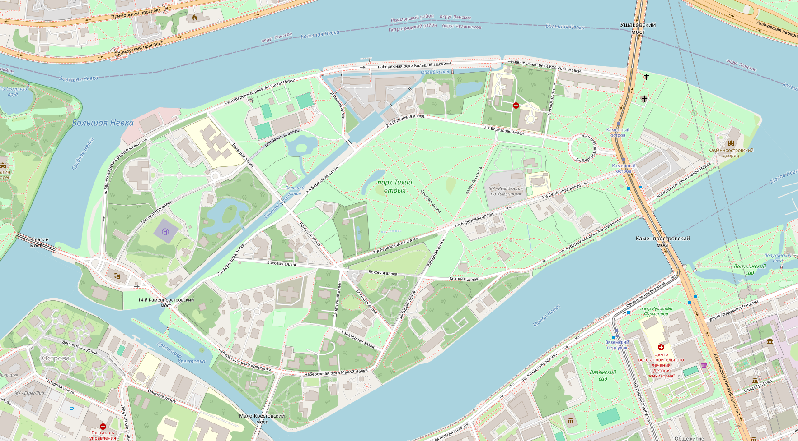
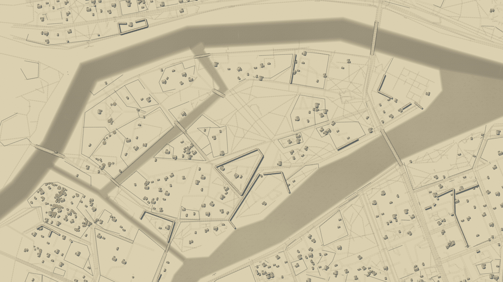

# CoK OSM Importer

Импортирует данные [OpenStreetMap](https://www.openstreetmap.org) (дороги, реки, озёра, леса, поля/посадки, деревья, здания) в файл карты редактора [Canvas of Kings](https://store.steampowered.com/) (`.mommap`). Сделано чтобы превратить реальное место в основу для настольной ролевой карты, а **не для точной картографии**.

English version: [README.md](README.md)




## Что импортируется, а что нет

**Импортируется:** дороги (как дорожные пути CoK), ~~реки/ручьи (водные сплайны)~~, озёра/пруды (водные плоскости), лес/кустарник (лесные плоскости — CoK сам заполняет их деревьями процедурно), поля/сады виноградники ("посадки", тип плоскости), заборы/стены/ палисады, точечные деревья, и здания (очень грубо).

**Пока не импортируется:** изгороди (у CoK для них своя система россыпи кустов, которую не удалось разобрать), дыры в мультиполигонах (озеро/лес с островом внутри импортируется так, будто острова нет — то есть "море вокруг острова" тоже не получится), relation-маршруты (route), реальный рельеф (всё ставится на `y = 0`; используй собственные инструменты рельефа CoK после импорта, если нужен ландшафт). Полный список известных проблем и идей — в [TODO.md](TODO.md), issue/PR приветствуются.

## Что нужно

- [.NET 10 SDK](https://dotnet.microsoft.com/download) или новее.
- OSM XML-экспорт нужной территории (вкладка "Export" на [openstreetmap.org](https://www.openstreetmap.org), [Overpass Turbo](https://overpass-turbo.eu/) или аналог — нужен `.osm`/`.xml`, не `.pbf`).
- Опционально — файл `.mommap`, который послужит базовым шаблоном (ради его настроек освещения/окружения — см. [Импорт без шаблона](#импорт-без-шаблона), если такого файла нет). Подойдёт любая настоящая карта CoK (это может быть ваше сохранение или что-то скачанное из Workshop в игре).


## Сборка

```
dotnet build
```

## Тесты

```
dotnet test
```

> (Часть тестов опционально грузит `template.mommap`/`mejka_map.osm` из корня репозитория, если вы положили туда свои копии — если файлов нет, тесты просто ничего не делают (no-op), так что весь набор проходит и на свежем клоне без всякой подготовки.)

## Быстрый старт

```
dotnet run --project src/CoK.OsmImporter.Cli -- ^
  --osm my-city.osm ^
  --template template.mommap ^
  --center 53.690,88.063 --radius 300 ^
  --scale 10 ^
  --out my-map.mommap
```

Команда читает `my-city.osm`, сохраняет освещение/настройки бумаги из `template.mommap`, импортирует только область радиусом 300м вокруг указанных координат, сжимает реальные метры в юниты карты в соотношении 10:1, и пишет `my-map.mommap`. Открой этот файл в Canvas of Kings.

## Ещё примеры

```
# Весь файл, без bbox — ок для уже небольшой территории (остров, посёлок).
dotnet run --project src/CoK.OsmImporter.Cli -- --osm island.osm --scale 10 --out island.mommap

# Только ландшафт — дороги/вода/лес/деревья, без зданий.
dotnet run --project src/CoK.OsmImporter.Cli -- --osm my-city.osm --scale 10 --profile base --out landscape-only.mommap

# Добавить в карту, которую уже правишь руками в CoK, вместо старта с нуля (эксперементально).
dotnet run --project src/CoK.OsmImporter.Cli -- --osm extra-district.osm --template my-in-progress-map.mommap --merge append --scale 10 --out my-in-progress-map.mommap

# Если всё ещё "path invalid" или "area too large" можно поменять `simplify` и `max-plot-area`.
dotnet run --project src/CoK.OsmImporter.Cli -- --osm my-city.osm --scale 10 --simplify 5 --max-plot-area 1000 --out my-map.mommap

# Посмотреть, какие комбинации тегов пропущены, чтобы дополнить mapping.json.
dotnet run --project src/CoK.OsmImporter.Cli -- --osm my-city.osm --scale 10 --unmapped-report unmapped.csv --out my-map.mommap
```

## Справочник по флагам CLI

```
cok-osm-import --osm <file.osm> --out <file.mommap> [опции]
```

| Флаг | Обязателен | По умолчанию | Значение |
|---|---|---|---|
| `--osm <путь>` | да | — | Исходный OSM XML-файл. |
| `--out <путь>` | да | — | Путь для выходного `.mommap`. |
| `--template <путь.mommap>` | нет | пустой холст | Базовая карта для сборки — см. ниже. |
| `--bbox <minLat,minLon,maxLat,maxLon>` | нет | весь файл | Явный прямоугольник координат для импорта. |
| `--center <lat,lon>` + `--radius <метры>` | нет | весь файл | Импорт круга (как bbox) вокруг точки. Взаимоисключим с `--bbox`. |
| `--profile <full\|base>` | нет | `full` | `full` = дороги+вода+лес/поля+деревья+здания. `base` = то же самое без зданий. |
| `--scale <метровНаЮнит>` | нет | `1.0` | Сколько реальных метров представляет один юнит карты CoK. `--scale 10` сжимает всё в 10 раз (Эмпирическим путем подобрано значение = 10 как самое "красивенькое"). |
| `--simplify <юниты>` | нет | `2.0` | Допуск упрощения линий, в **юнитах карты на выходе** (не зависит от `--scale`). Может быть увеличен, если CoK ругается "path invalid". `0` отключает упрощение. |
| `--max-fill <число>` | нет | `2000` | Потолок на забейканные объекты-заливку (деревья, трава...) на одну лесную/полевую зону — см. [Заливка леса](#заливка-леса). `0` отключает заливку полностью. |
| `--max-plot-area <юниты²>` | нет | `2000` | Полигон зоны (лес/поле/вода) крупнее этого значения режется на сетку кусков поменьше вместо одного целого — см. [Заливка леса](#заливка-леса). `0` или отрицательное отключает разбиение. |
| `--merge <append\|replace>` | нет | `append` | `append` добавляет импортированное к существующему содержимому `--template`. `replace` сначала очищает объекты/пути (настройки освещения/бумаги остаются). |
| `--mapping <путь>` | нет | встроенный | Использовать свой конфиг маппинга тег→ассет вместо встроенного по умолчанию — см. [Настройка маппинга](#настройка-маппинга). |
| `--init-mapping <путь>` | нет | — | Записать встроенный конфиг маппинга по умолчанию в `<путь>` и выйти (не требует `--osm`/`--out`). Отредактируй и передай обратно через `--mapping`. |
| `--unmapped-report <путь>` | нет | — | Записать CSV со всеми комбинациями тегов, для которых не нашлось правила — чтобы видеть, что было пропущено. |
| `--help` | нет | — | Показать справку. |

### Выбор области

Если не указать ни `--bbox`, ни `--center`/`--radius` — импортируется **весь** файл целиком. Для чего-то крупнее небольшого посёлка это даёт огромную карту — при таком запуске CLI выводит предупреждение. На нрактике для тестов я использовал всю экспортированную `osm` область (максимально доступную), при 64 GB RAM не было проблем.

### Импорт без шаблона

Без `--template` инструмент стартует с пустого холста — но с **настоящими** настройками освещения/ тумана/цвета воды/бумаги по умолчанию (скопированы из рабочей карты CoK на этапе сборки), а не с пустыми. Более ранняя версия этого инструмента писала туда реально пустые настройки, что CoK рисует как полностью неосвещённый, прозрачный, серый экран — если у тебя именно так, значит сборка устаревшая, пересобери из исходников.

### Настройка маппинга

В `mapping.json` описаны свойства по типу "тег OSM X к префаб CoK Y", в виде обычного редактируемого JSON, в коде импортера ничего не зашито жёстко. Так что вы можете исправить теги `OSM` к тегам `CoK` (PR приветствуется, так как теги в данном репозитории смаплены с помощью Claude в автоматическом режиме).

Получить копию:

```
dotnet run --project src/CoK.OsmImporter.Cli -- --init-mapping my-mapping.json
```

затем отредактируй и передай обратно через `--mapping my-mapping.json`. В начале файла есть секция `notes`, отмечающая места, Claude **гадал**, а именно:

- **Дороги** (секция `roads`): у `pa_road.tscn` есть 7 визуальных вариантов в CoK (`path_type` 17–23). По умолчанию иерархия `highway=*` из OSM раскидана по ним по *разумному*   предположению Claude (вот и думайте). В to-do открыть CoK, нарисовать по одному сегменту каждого `path_type`, посмотреть как они реально выглядят, и перепривять значения `highway` в `"roads"` соответственно.
- **Здания** (секция `buildings`): у CoK нет префабов под большинство реальных категорий зданий/магазинов. Сейчас по умолчанию всё падает на обычные хижины, кроме нескольких значений тегов   (`amenity=pub/bar/restaurant/cafe` → таверна, `shop=*`/`amenity=marketplace` → рыночные лотки, но по ощущениям не срабатывает верно).

### Заливка леса

CoK **не заполняет** лесную зону деревьями процедурно при загрузке карты, он бейкает реальные экземпляры деревьев/травы в файл в момент рисования зоны в редакторе. Зона без забейканной заливки рендерится как пустая, так что импортёр сам печёт заливку для совпадений `forest_polygon` (`natural=wood`/`natural=scrub`/`landuse=forest`): взвешенный скаттер из деревьев, пучков травы и редкого сушняка, с плотностью/миксом, разобранными по настоящей забейканной CoK'ом тестовой зоне. Настраивается через `mapping.json`: `forest_polygon.fill` (список ассетов с весами) и `forest_polygon.fill_density` (объектов на юнит² выходной карты, **не** зависит от `--scale` — та же логика, что и у `--simplify`, см. ниже).

> Я не знаю на сколько это совместимо и безопасно, но на данном этапе фатальных ошибок не было.

`--max-fill` ограничивает это на одну зону: реальные лесные полигоны OSM бывают большими, и плотность CoK, рассчитанная под маленькие рукописные зоны. Если полигон одной зоны больше `--max-plot-area`, он сначала режется на сетку кусков поменьше, разбиение оставляет видимый шов по линиям сетки, но делит бюджет заливки между кусками, а не умножает его. При этом встречались фрагменты, вызывающие "area to large", но при этом деревья внутри зоны были.

`landuse=farmland`/сады/etc. (`farmland_polygon`) пока импортируются как пустые, незалитые зоны — CoK заполняет поля *рядами* растянутого объекта (больше похоже на то, как устроены дороги), а не случайным скаттером, и это ещё не реализовано. См. [TODO.md](TODO.md).

## Известные ограничения / на что обратить внимание

- **Нет "моря вокруг острова".** Плоскость океана в CoK требует дырку посередине (остров), а импортёр пока умеет только простые полигоны без дырок. См. [TODO.md](TODO.md).
- **Импорт большой площади может быть буквально огромным** относительно того, что вообще представляют карты CoK. Я тестировал импортер с включенной "увеличенной областью" в настройках игры.
- **Изредка встречаются перекрученные/самопересекающиеся дороги, области лесов** на реальных OSM-данных, причина пока не найдена, вероятно связана с тем, как упрощение линий взаимодействует с резкими реальными поворотами. См. [TODO.md](TODO.md).
- **Рендеринг рек:** пока не получилось решить проблему импорта рек. В `OSM` данных реки представленны как линия (без толщины), к этому в дополнение в данных есть "водоем" - представляет многоугольник, но попытка рисовать в CoK "озеро" вместо "реки" ни к чему не привело, возможно нужно также резать область как лес.
- Здания ставятся в центроид контура с грубым направлением (по самой длинной стороне контура) и небольшим случайным разбросом масштаба, это не точное совпадение с исходным размером/формой здания в OSM.
- Выбор префаба дерева/здания детерминирован (зависит от id OSM-элемента), так что повторный запуск с тем же `mapping.json` всегда даёт одинаковый результат.

## Структура проекта

```
src/CoK.OsmImporter.Core/   библиотека классов — парсинг OSM, гео-проекция, модель данных .mommap,
                             каталог ассетов, конфиг маппинга и сам конвейер конвертации
src/CoK.OsmImporter.Cli/    консольная точка входа (это то, что реально запускается)
tests/                       набор тестов xUnit, включая round-trip тесты на реальном
                             template.mommap и интеграционные тесты конвейера конвертации
```

## Контрибьютинг

Issue и PR приветствуются — в [TODO.md](TODO.md) приоритизированный список известных открытых проблем, включая те, где просто нужно посмотреть на карту с элементами, см. [Настройка маппинга](#настройка-маппинга)). Самый надёжный способ: нарисовать руками маленький пример в редакторе CoK, сохранить, и сравнить сырой JSON с тем, что генерирует этот инструмент для того же объекта — именно так были разгаданы форматы дорог и рек.

## Лицензия

[MIT](LICENSE). Реверс-инженеренные детали формата `.mommap` (таблицы id `path_type`/`object_type`,
имена полей и т.п.) — это просто факты о формате файла, не защищённый авторским правом контент
игры. Никакие игровые ассеты или файлы карт CoK в этот репозиторий не включены.
